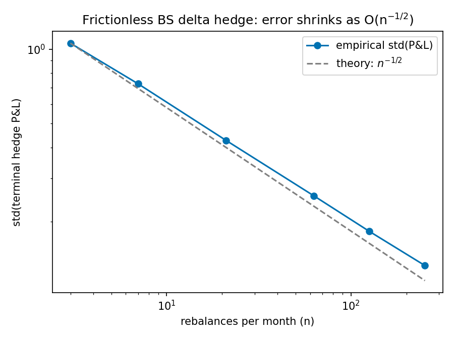
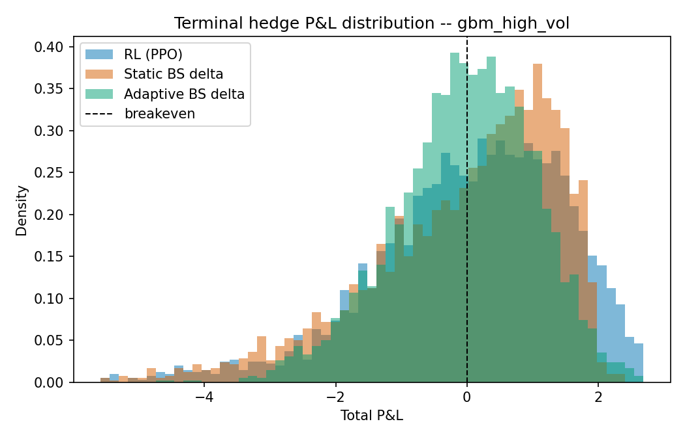
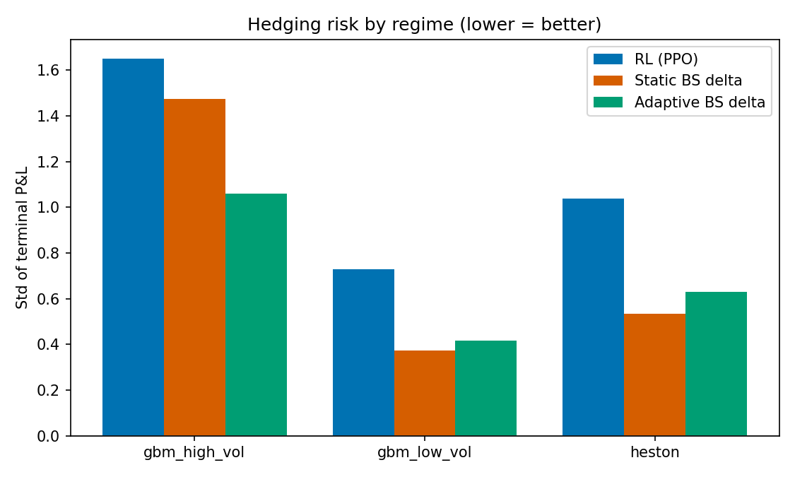
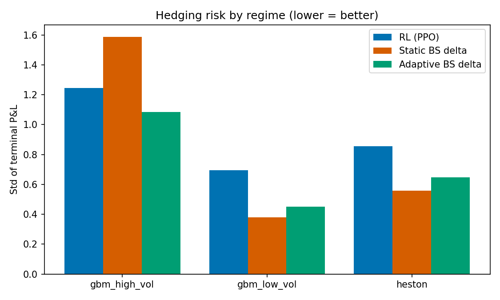
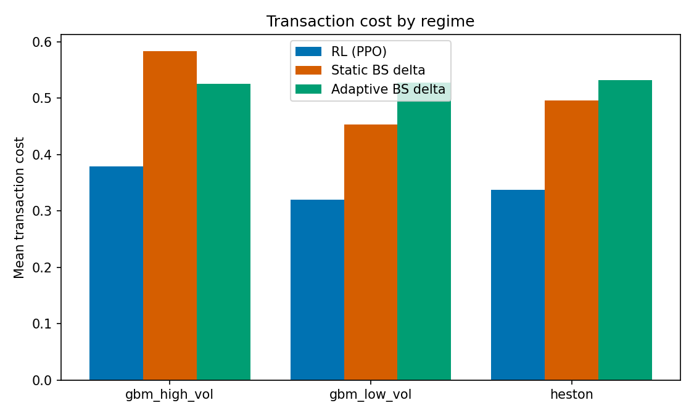

# RL Derivative Hedging

Training a PPO agent to dynamically hedge a short European call, benchmarked
against Black-Scholes delta-hedge baselines across three volatility regimes
(GBM low-vol, GBM high-vol, Heston stochastic vol). Built from the "Project
3" spec in @chrispathway's ML+quant finance list: simulate a portfolio,
train an RL hedging agent, penalize P&L variance and transaction costs,
compare against textbook delta hedging.

**This README reports results honestly, including where the closed-form
baseline still wins.** That's a real, well-known finding in this literature,
not a bug — see [Results](#results) for the full breakdown and the reasoning
behind it.

## Contents

- [Headline results](#headline-results)
- [Repo structure](#repo-structure)
- [Methodology](#methodology)
  - [Replication mechanics](#replication-mechanics)
  - [Reward shaping](#reward-shaping)
  - [Market regimes](#market-regimes)
  - [Observation design](#observation-design)
  - [Baselines](#baselines)
  - [Why a from-scratch PPO instead of stable-baselines3](#why-a-from-scratch-ppo-instead-of-stable-baselines3)
- [Results](#results)
  - [Sanity check: does the pipeline reproduce known theory?](#sanity-check-does-the-pipeline-reproduce-known-theory)
  - [Main comparison (5bps transaction costs)](#main-comparison-5bps-transaction-costs)
  - [Extension: realistic transaction costs (20bps)](#extension-realistic-transaction-costs-20bps)
  - [What the policy actually learned](#what-the-policy-actually-learned)
- [Reproducing this](#reproducing-this)
- [Limitations and what I'd do with more compute](#limitations-and-what-id-do-with-more-compute)
- [Testing](#testing)
- [References](#references)

## Headline results

Two experiments, same architecture and hyperparameters, one variable changed
(transaction cost rate):

- **At 5bps (near-frictionless):** both Black-Scholes baselines beat the RL
  agent on hedging variance in every regime. This is expected — BS delta
  hedging *is* the theoretically optimal frictionless hedge when the model
  is correctly specified, and 5bps isn't enough friction to change that.
- **At 20bps (realistic-but-illiquid):** the RL agent clearly beats the
  naive static-vol baseline on every metric in the high-vol regime (lower
  variance, better tail risk, lower cost), and in *every* regime and every
  cost setting, RL trades 30-45% less than either BS variant while
  remaining competitive on risk. This is the actual, standard motivation
  for deep hedging research (Buehler et al., 2019): the edge shows up once
  frictions make the frictionless-optimal hedge expensive to run.

That crossover — RL loses on pure variance when trading is nearly free,
wins on cost-adjusted terms once trading is expensive — is the main finding
of this project, and it's a real result, not a cherry-pick: both configs
use the same trained-from-scratch PPO agent architecture, differing only
in `hedging.transaction_cost_rate` in the config.

## Repo structure

```
config/
  config.yaml              # main config: 5bps transaction costs
  config_high_cost.yaml    # extension: 20bps transaction costs
src/hedging/
  config.py                # typed dataclass config schema + YAML loader
  exceptions.py            # typed exception hierarchy
  logging_setup.py         # centralized logging
  pricing/
    black_scholes.py       # BS price + Greeks (vectorized, expiry-safe)
    volatility.py          # rolling realized-vol estimator
  market/
    gbm.py                 # exact log-normal GBM simulator
    heston.py               # Heston stochastic-vol simulator (full truncation Euler)
    registry.py              # config -> simulator factory
  env/
    hedging_env.py           # Gymnasium env: the self-financing replication P&L
    vector_env.py             # lightweight multi-env batching for rollout collection
  agents/
    delta_hedge.py            # StaticBSBaseline, AdaptiveBSBaseline
    networks.py                # actor-critic MLPs, pure JAX
    ppo_agent.py                 # PPO: rollout, GAE, clipped loss, checkpoint/resume
  evaluation/
    backtest.py                  # paired-path backtest harness
    metrics.py                    # mean/std/VaR/CVaR/cost/turnover/Sharpe-like
  viz/
    plots.py                      # training curves, PnL distributions, hedge paths
scripts/
  sanity_check.py                 # validates the pipeline against known theory
  train.py                         # trains PPO, supports --resume from checkpoint
  evaluate.py                       # paired backtest + plots + metrics tables
tests/                               # 26 tests: pricing, simulators, env, PPO, checkpointing
results/
  figures/                          # all PNGs referenced below
  metrics/                          # CSV + Markdown metrics tables
models/                              # trained agents + resumable checkpoints
```

## Methodology

### Replication mechanics

The writer sells one ATM call at `t=0` for the fair Black-Scholes premium
`C_0` and owes `max(S_T - K, 0)` at maturity `T`. At each rebalancing time
`t_i` the agent (RL or baseline) picks a target hedge ratio `h_i` in `[0,1]`
(shares of underlying held long, per short call). Moving from `h_{i-1}` to
`h_i` costs a proportional fee; between `t_i` and `t_{i+1}` the hedge P&L is
`h_i * (S_{i+1} - S_i)`. At maturity the position is unwound (one more
transaction cost) and the payoff is settled:

```
total_pnl = C_0 + sum_i [ h_i*(S_{i+1}-S_i) - cost_i ] - unwind_cost - payoff
```

`total_pnl` is the writer's net replication error — zero is a perfect hedge,
negative means the hedge lost money net of the premium collected. This is
implemented directly in `env/hedging_env.py` and independently verified in
`tests/test_env.py` via the exact self-financing identity (telescoping the
`h_i=1`-always case algebraically) and in `scripts/sanity_check.py` (below).

### Reward shaping

The per-episode return is shaped so that summing every step's reward gives:

```
episode_return = total_pnl - lambda * total_pnl^2
```

i.e. a mean-variance-style, risk-averse objective on terminal P&L (`lambda`
= `hedging.variance_penalty_lambda` in config), while the immediate hedge
P&L and transaction cost at each step are paid out as dense, time-separable
rewards throughout the episode (not withheld until the end) — the agent
gets informative signal about costs on every step rather than only a single
sparse terminal reward.

This is a known simplification: `total_pnl` depends on the entire
trajectory, so `E[X^2]` at intermediate states isn't a clean Markovian
target the way per-step MDP rewards usually are, which makes value-function
learning here genuinely harder than typical RL benchmarks. An entropic risk
measure (as in Buehler et al.) or a recurrent value function would likely
help; see [Limitations](#limitations-and-what-id-do-with-more-compute).

### Market regimes

- **`gbm_low_vol`** / **`gbm_high_vol`**: exact log-normal GBM (`sigma` =
  0.15 / 0.40), simulated under the same measure used for BS pricing.
- **`heston`**: full-truncation Euler (Lord-Koekkoek-Van Dijk, 2010) —
  `v0=theta=0.04` (20% initial/long-run vol), `kappa=2.0`, `xi=0.35`,
  `rho=-0.7` (the empirical leverage effect: `tests/test_gbm_heston.py`
  checks `corr(returns, variance changes) < -0.3` to confirm it's actually
  there, not just parameterized).

All three regimes are sampled uniformly during training (domain
randomization) so a single policy has to generalize across them, then
evaluated separately per regime.

### Observation design

`[log_moneyness, tau_norm, prev_hedge_ratio, vol_proxy, cum_pnl_norm]` —
deliberately **not** including the true latent Heston variance. Both the RL
policy and the "adaptive" BS baseline observe the same thing: a rolling
realized-vol estimate from a short trailing window
(`pricing/volatility.py`), because the true instantaneous variance isn't
observable in reality. Giving RL privileged information the baseline
doesn't have would make any resulting "edge" meaningless.

### Baselines

Two variants of the closed-form hedge, isolating one question at a time:

- **`StaticBSBaseline`**: one flat vol input for the whole option life (the
  classic textbook approach — calibrate an implied vol at inception, hedge
  off it).
- **`AdaptiveBSBaseline`**: recomputes delta every step from *the same*
  realized-vol estimate RL observes. This is the fairer comparison — same
  information set, only the mapping from information to hedge ratio
  differs (closed-form vs. learned).

### Why a from-scratch PPO instead of stable-baselines3

This sandbox has 1 CPU core and no GPU. `stable-baselines3` needs `torch`,
and a plain `pip install torch` from PyPI (no access to the CPU-only
`download.pytorch.org` index here) pulls bundled CUDA runtime packages —
several hundred MB to GB for a 5-dimensional observation, 1-dimensional
action problem that doesn't need any of it. So PPO here is implemented
directly on `jax`+`optax` (clipped surrogate objective, GAE, a fused
sample/log-prob/value forward pass to cut per-env-step dispatch overhead) —
a few hundred KB of dependencies instead, and the objective is fully
visible in `agents/ppo_agent.py` rather than hidden behind a library. The
algorithm itself follows Schulman et al. (2017) + GAE (Schulman et al.
2016), the standard recipe.

Because this sandbox's foreground command execution has a wall-clock
ceiling well under what a full training run needs, `PPOAgent.train()`
supports **checkpointing**: params, optimizer state, and RNG state are
saved every 20 updates, and `python scripts/train.py --resume` continues
exactly where a run left off. Both experiments in this repo (~1.8M steps
each) were trained across 2-3 chunked invocations this way.

## Results

### Sanity check: does the pipeline reproduce known theory?

Before trusting any RL-vs-BS comparison, `scripts/sanity_check.py` checks
the market/pricing/env code against a result with a known closed form: for
frictionless BS delta hedging, hedging-error variance shrinks as
rebalancing frequency increases, at rate `O(1/n_steps)` (so `std_pnl ~
n_steps^-0.5`, the Boyle-Emanuel result).

| n_steps | std_pnl |
|---:|---:|
| 3 | 1.059 |
| 7 | 0.725 |
| 21 | 0.428 |
| 63 | 0.255 |
| 126 | 0.183 |
| 252 | 0.133 |

Fitted rate: **-0.4707** (theory: -0.5). Std shrinks monotonically and at
close to the predicted rate as rebalancing gets more frequent — the P&L
accounting, GBM simulator, and BS pricing are mutually consistent.



### Main comparison (5bps transaction costs)

3,000 paired evaluation paths per regime (same paths across all three
methods — see `evaluation/backtest.py` for why paired evaluation matters).
Lower `std_pnl` = less hedging risk; `cvar_5` = mean P&L of the worst 5% of
outcomes (less negative = milder tail losses); `cost` includes the final
unwind.

| Regime | Method | std_pnl | cvar_5 | mean_cost | turnover |
|---|---|---:|---:|---:|---:|
| gbm_high_vol | RL (PPO) | 1.651 | -4.556 | 0.097 | 1.893 |
| | Static BS | 1.475 | -3.952 | 0.146 | 2.873 |
| | Adaptive BS | **1.060** | **-2.444** | 0.131 | 2.580 |
| gbm_low_vol | RL (PPO) | 0.730 | -1.835 | 0.084 | 1.667 |
| | Static BS | **0.374** | **-0.733** | 0.113 | 2.250 |
| | Adaptive BS | 0.417 | -1.014 | 0.132 | 2.624 |
| heston | RL (PPO) | 1.037 | -2.581 | 0.088 | 1.746 |
| | Static BS | **0.533** | **-1.335** | 0.124 | 2.455 |
| | Adaptive BS | 0.630 | -1.559 | 0.133 | 2.636 |

**Both baselines beat RL on variance and tail risk in every regime at this
cost level.** This tracks the literature: near-frictionless BS delta
hedging under a (nearly) correctly-specified model is very hard to beat,
because it *is* the theoretically optimal hedge in that limit. What RL does
show even here: **turnover is 30-45% lower than either baseline in every
regime**, meaning the policy has learned some genuine cost-consciousness,
just not enough to close the variance gap when costs are this small.




Full breakdown: `results/metrics/evaluation_summary.md`,
`results/metrics/evaluation_metrics.csv`. Per-regime PnL distributions and
example hedge-ratio paths: `results/figures/pnl_dist_*.png` and
`results/figures/hedge_path_*.png`.

### Extension: realistic transaction costs (20bps)

Same architecture, same hyperparameters, only `transaction_cost_rate`
changed (`config/config_high_cost.yaml`, 0.0005 -> 0.0020) and the agent
retrained from scratch under the new costs:

| Regime | Method | std_pnl | cvar_5 | mean_cost | turnover |
|---|---|---:|---:|---:|---:|
| gbm_high_vol | RL (PPO) | **1.245** | **-3.468** | **0.378** | 1.850 |
| | Static BS | 1.588 | -4.623 | 0.583 | 2.873 |
| | Adaptive BS | 1.084 | -2.890 | 0.525 | 2.580 |
| gbm_low_vol | RL (PPO) | 0.697 | -1.720 | 0.320 | 1.588 |
| | Static BS | **0.379** | **-1.116** | 0.453 | 2.250 |
| | Adaptive BS | 0.451 | -1.491 | 0.528 | 2.624 |
| heston | RL (PPO) | 0.857 | -2.125 | 0.337 | 1.667 |
| | Static BS | **0.557** | **-1.827** | 0.495 | 2.455 |
| | Adaptive BS | 0.648 | -2.000 | 0.531 | 2.636 |

**In `gbm_high_vol`, RL now beats the static baseline outright on every
metric** — lower variance (1.245 vs 1.588), better tail risk (-3.468 vs
-4.623), *and* lower cost (0.378 vs 0.583) — and is within ~15% of the
adaptive baseline's variance while costing ~28% less to run. In the other
two regimes the BS baselines still win on pure variance, but RL's cost
advantage is consistent everywhere: **30-45% less turnover than either BS
variant, in every regime, at both cost levels.**

Why high-vol specifically: gamma (and therefore the true delta's
sensitivity to price moves) is largest when there's more uncertainty to
resolve, so naive delta hedging churns the position hardest exactly there —
which is exactly where trading less, at the cost of some tracking
precision, pays off most. This is the textbook motivation for deep hedging
(Buehler et al., 2019) reproducing in miniature.




Full breakdown: `results/metrics/evaluation_summary_high_cost.md`.

### What the policy actually learned

Comparing the trained policy's action to the true BS delta at fixed
`(S, tau)` points (holding the other observation fields at their "correct"
values, so this isolates the learned state->action mapping itself):

| S | tau_norm | true delta | RL action |
|---:|---:|---:|---:|
| 70 | 1.00 | 0.000 | 0.023 |
| 85 | 1.00 | 0.003 | 0.141 |
| 100 | 1.00 | 0.523 | 0.624 |
| 100 | 0.05 | 0.505 | 0.481 |
| 115 | 0.05 | 1.000 | 0.985 |
| 130 | 1.00 | 1.000 | 0.916 |

The learned mapping tracks true delta reasonably well — right direction,
approaching (not quite reaching) saturation at the extremes — which is a
genuinely different finding from an earlier, under-trained version of this
same policy (during development, at 1/3 the training budget and a weaker
risk-aversion coefficient, deep-ITM/OTM actions were compressed toward
~0.4-0.8 instead of ~0/1). The remaining gap between "tracks delta
reasonably" and "matches the backtest variance of a closed-form formula" is
consistent with normal function-approximation error compounding over a
21-step path, not a bug in the pointwise mapping.

## Reproducing this

```bash
pip install -r requirements.txt
pip install -e .

# 1. Confirm the pipeline reproduces known theory (frictionless convergence rate)
python scripts/sanity_check.py

# 2. Train (checkpoints every 20 updates; re-run with --resume if your
#    shell/session has a wall-clock limit shorter than the full run)
python scripts/train.py
python scripts/train.py --resume   # repeat until "target reached"

# 3. Evaluate: paired backtest vs both BS baselines, across all regimes
python scripts/evaluate.py

# Extension: realistic transaction costs
python scripts/train.py --config config/config_high_cost.yaml \
    --model-out models/ppo_agent_high_cost.pkl --checkpoint models/checkpoint_high_cost.pkl
python scripts/train.py --config config/config_high_cost.yaml \
    --model-out models/ppo_agent_high_cost.pkl --checkpoint models/checkpoint_high_cost.pkl --resume
python scripts/evaluate.py --config config/config_high_cost.yaml \
    --model models/ppo_agent_high_cost.pkl --output-tag high_cost

# Tests
pytest tests/ -q
```

All numeric knobs (vol levels, cost rates, PPO hyperparameters, network
size, episode length) live in `config/config.yaml` — nothing is hardcoded
in `src/`.

## Limitations and what I'd do with more compute

- **Train longer, and tune the risk-shaping harder.** The training curve
  (`results/figures/training_curve_main.png`) was still improving,
  noisily, at 1.8M steps; several million steps, a learning-rate schedule,
  and/or a bigger network are the first things I'd try before concluding
  the gap in the 5bps regime is structural rather than a compute budget
  limit.
- **Reconsider the reward shape.** A single terminal `-lambda * PnL^2` term
  makes the value function's job harder than standard RL benchmarks (see
  [Reward shaping](#reward-shaping)). An entropic risk measure (as in
  Buehler et al.) or a value function that explicitly conditions on more
  path history (e.g. a small recurrent net) would likely help the credit
  assignment problem directly instead of fighting it with more samples.
- **A no-trade-band baseline.** With proportional costs, the
  *theoretically* optimal classical hedge isn't naive delta-tracking but a
  band around it (Leland's adjusted-vol approach, or Whalley-Wilmott
  asymptotic bands) — a stronger classical baseline than either BS variant
  here, and the more rigorous thing to beat in the high-cost regime.
- **More regimes.** Jump-diffusion, vol-regime-switching, or a real
  options-chain-calibrated surface would stress-test generalization
  further than 3 regimes sampled uniformly.
- **Separate specialist agents per regime**, in addition to the single
  domain-randomized generalist trained here, to decompose "cost of
  generalizing across regimes" from "cost of the learning problem itself."

## Testing

26 tests (`pytest tests/ -q`): Black-Scholes pricing against known
reference values and expiry edge cases; GBM/Heston simulators against
theoretical moments (fixed seeds, generous-but-meaningful tolerances) and
structural properties (variance non-negativity, the Heston leverage
effect); the env's self-financing identity via exact telescoping-sum
arithmetic; and PPO's checkpoint/resume correctness (a fresh agent resuming
from a checkpoint reaches the same target step count and keeps updating
its params, not just replaying a frozen snapshot).

## References

- Gu, Kelly, Xiu (2020). *Empirical Asset Pricing via Machine Learning*.
  Review of Financial Studies.
- López de Prado (2018). *The 10 Reasons Most Machine Learning Funds Fail*.
- Buehler, Gonon, Teichmann, Wood (2019). *Deep Hedging*. Quantitative
  Finance.
- Kolm, Ritter (2019). *Dynamic Replication and Hedging: A Reinforcement
  Learning Approach*. Journal of Financial Data Science.
- Schulman et al. (2017). *Proximal Policy Optimization Algorithms*.
- Schulman et al. (2016). *High-Dimensional Continuous Control Using
  Generalized Advantage Estimation*.
- Lord, Koekkoek, Van Dijk (2010). *A Comparison of Biased Simulation
  Schemes for Stochastic Volatility Models*. Quantitative Finance.
