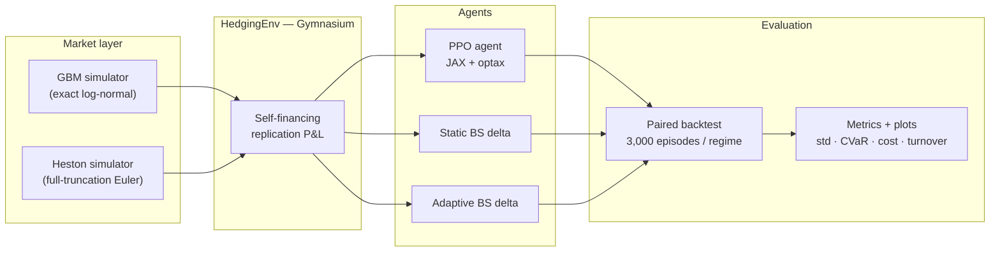
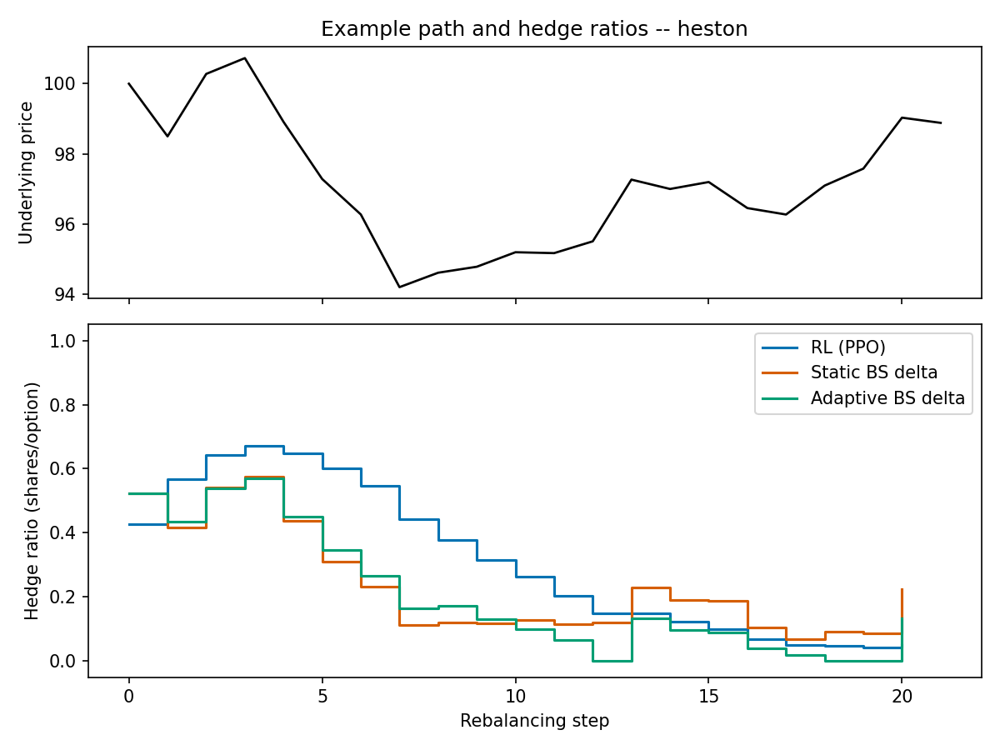
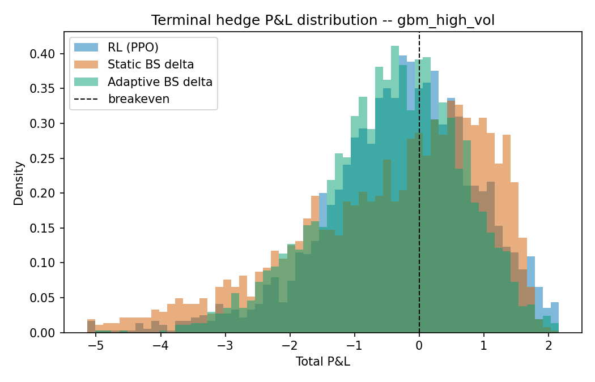

<div align="center">

# RL Derivative Hedging

### Teaching a PPO agent to hedge options — and finding out exactly when it beats Black-Scholes, and when it doesn't

[](https://www.python.org/)
[](LICENSE)
[](#testing)
[](https://github.com/google/jax)
[](https://gymnasium.farama.org/)

*A deep hedging implementation: GBM + Heston market simulators, a Gymnasium
environment modeling the self-financing replication problem, a from-scratch
PPO agent, and two Black-Scholes delta-hedge baselines — evaluated across
three volatility regimes and two transaction-cost regimes, on 3,000 paired
paths each.*

</div>

<br>

<table>
<tr>
<td width="50%"></td>
<td width="50%"></td>
</tr>
<tr>
<td align="center"><sub><b>5 bps transaction costs</b> — both BS baselines win</sub></td>
<td align="center"><sub><b>20 bps transaction costs</b> — RL wins outright in the high-vol regime</sub></td>
</tr>
</table>

> **TL;DR.** Same PPO agent, same architecture, one config value changed
> (`transaction_cost_rate`). At near-frictionless costs, naive delta hedging
> is close to unbeatable — as theory says it should be. Once trading is
> costly, RL learns to trade 30-45% less than either Black-Scholes variant
> **in every regime**, and in the high-volatility regime that's enough to
> beat the naive baseline outright on variance, tail risk, *and* cost. That
> crossover is the actual finding of this project, and the standard
> motivation for deep hedging research in the first place.

## At a glance

| | |
|---|---|
| **Volatility regimes** | GBM low-vol (σ=0.15), GBM high-vol (σ=0.40), Heston stochastic vol (leverage effect, verified) |
| **Evaluation** | 3,000 *paired* paths per regime — same paths across every method, both cost settings |
| **RL agent** | PPO from scratch (JAX + optax) — clipped surrogate objective, GAE, checkpoint/resume training |
| **Baselines** | Static-vol and realized-vol-adaptive Black-Scholes delta hedging |
| **Validation** | Pipeline reproduces the Boyle-Emanuel `O(n⁻¹ᐟ²)` convergence rate before any RL result is trusted |
| **Tests** | 26 passing — pricing, simulators, self-financing P&L identity, checkpoint correctness |

## Contents

- [Motivation](#motivation)
- [Quickstart](#quickstart)
- [Architecture](#architecture)
- [Methodology](#methodology)
  - [Replication mechanics](#replication-mechanics)
  - [Reward shaping](#reward-shaping)
  - [Market regimes](#market-regimes)
  - [Observation design](#observation-design)
  - [Baselines](#baselines)
  - [Why a from-scratch PPO instead of stable-baselines3](#why-a-from-scratch-ppo-instead-of-stable-baselines3)
- [Results](#results)
  - [Sanity check: does the pipeline reproduce known theory?](#sanity-check-does-the-pipeline-reproduce-known-theory)
  - [Main comparison — 5bps transaction costs](#main-comparison--5bps-transaction-costs)
  - [Extension — 20bps transaction costs](#extension--20bps-transaction-costs)
  - [What the policy actually learned](#what-the-policy-actually-learned)
- [Limitations and roadmap](#limitations-and-roadmap)
- [Testing](#testing)
- [References](#references)
- [License](#license)
- [Author](#author)

## Motivation

Classic Black-Scholes delta hedging assumes continuous, frictionless
rebalancing under a known, constant volatility. Real markets have neither:
trading costs money, volatility is stochastic, and rebalancing happens in
discrete steps. **Deep hedging** (Buehler, Gonon, Teichmann & Wood, 2019)
reframes hedging as a sequential decision problem and lets a neural network
learn a hedging policy directly from simulated experience, optimizing a
risk-aware objective instead of a closed-form Greek.

This repo builds that pipeline end to end — not as a demo that assumes RL
wins, but as an actual experiment with a control: the same agent trained
and evaluated under two cost regimes, so the comparison to classical
hedging is honest in both directions.

## Quickstart

```bash
git clone <this-repo> && cd rl-derivative-hedging
pip install -r requirements.txt && pip install -e .

python scripts/sanity_check.py     # validates the pipeline against known theory
python scripts/train.py            # trains PPO (checkpoints every 20 updates)
python scripts/train.py --resume   # continue if your session has a time limit
python scripts/evaluate.py         # paired backtest vs. both BS baselines
pytest tests/ -q                   # 26 tests
```

All knobs (vol levels, cost rates, PPO hyperparameters, network size,
episode length) live in `config/config.yaml` — nothing is hardcoded in
`src/`. The 20bps extension is `config/config_high_cost.yaml`; see
[Extension — 20bps transaction costs](#extension--20bps-transaction-costs) below.

## Architecture



<details>
<summary><b>Full repo structure</b> (click to expand)</summary>

```
config/
  config.yaml              # main config: 5bps transaction costs
  config_high_cost.yaml    # extension: 20bps transaction costs
src/hedging/
  config.py                # typed dataclass config schema + YAML loader
  exceptions.py             # typed exception hierarchy
  logging_setup.py          # centralized logging
  pricing/
    black_scholes.py        # BS price + Greeks (vectorized, expiry-safe)
    volatility.py            # rolling realized-vol estimator
  market/
    gbm.py                   # exact log-normal GBM simulator
    heston.py                 # Heston stochastic-vol simulator
    registry.py                # config -> simulator factory
  env/
    hedging_env.py             # Gymnasium env: self-financing replication P&L
    vector_env.py                # lightweight multi-env batching
  agents/
    delta_hedge.py                # StaticBSBaseline, AdaptiveBSBaseline
    networks.py                     # actor-critic MLPs, pure JAX
    ppo_agent.py                      # PPO: rollout, GAE, clipped loss, checkpointing
  evaluation/
    backtest.py                        # paired-path backtest harness
    metrics.py                           # mean/std/VaR/CVaR/cost/turnover/Sharpe-like
  viz/
    plots.py                              # training curves, PnL distributions, hedge paths
scripts/
  sanity_check.py                        # validates the pipeline against known theory
  train.py                                # trains PPO, supports --resume from checkpoint
  evaluate.py                              # paired backtest + plots + metrics tables
tests/                                      # 26 tests
results/
  figures/                                  # every PNG referenced in this README
  metrics/                                   # CSV + Markdown metrics tables
models/                                       # trained agents
```

</details>

## Methodology

### Replication mechanics

The writer sells one ATM call at `t=0` for the fair Black-Scholes premium
`C_0` and owes `max(S_T - K, 0)` at maturity `T`. At each rebalancing time
`t_i` the agent (RL or baseline) picks a target hedge ratio `h_i ∈ [0,1]`
(shares of underlying held long, per short call). Moving from `h_{i-1}` to
`h_i` costs a proportional fee; between `t_i` and `t_{i+1}` the hedge P&L is
`h_i · (S_{i+1} - S_i)`. At maturity the position is unwound (one more
transaction cost) and the payoff is settled:

```
total_pnl = C_0 + Σᵢ [ h_i·(S_{i+1}-S_i) - cost_i ] - unwind_cost - payoff
```

`total_pnl` is the writer's net replication error — zero is a perfect
hedge, negative means the hedge lost money net of the premium collected.
Implemented in `env/hedging_env.py`, independently verified in
`tests/test_env.py` via the exact self-financing identity (telescoping the
`h_i=1`-always case algebraically), and stress-tested against known theory
in `scripts/sanity_check.py` (below).

### Reward shaping

The per-episode return is shaped so summing every step's reward gives:

```
episode_return = total_pnl - λ · total_pnl²
```

a mean-variance-style, risk-averse objective on terminal P&L (`λ` =
`hedging.variance_penalty_lambda`), while immediate hedge P&L and
transaction cost are paid out as dense, time-separable rewards every step —
not withheld until the end.

<details>
<summary>Why this is harder to learn than a typical RL benchmark</summary>

<br>

`total_pnl` depends on the entire trajectory, so `E[X²]` at intermediate
states isn't a clean Markovian target the way per-step MDP rewards usually
are — this makes value-function learning genuinely harder here than in
standard benchmarks. An entropic risk measure (as in Buehler et al.) or a
recurrent value function would likely help; see
[Limitations](#limitations-and-roadmap).

</details>

### Market regimes

- **`gbm_low_vol`** / **`gbm_high_vol`**: exact log-normal GBM (`σ` = 0.15 /
  0.40), simulated under the same measure used for BS pricing.
- **`heston`**: full-truncation Euler (Lord-Koekkoek-Van Dijk, 2010) —
  `v0=θ=0.04` (20% initial/long-run vol), `κ=2.0`, `ξ=0.35`, `ρ=-0.7` (the
  empirical leverage effect — `tests/test_gbm_heston.py` checks
  `corr(returns, Δvariance) < -0.3` to confirm it's actually present, not
  just parameterized).

All three regimes are sampled uniformly during training (domain
randomization), so one policy has to generalize across them, then each is
evaluated separately.

### Observation design

`[log_moneyness, tau_norm, prev_hedge_ratio, vol_proxy, cum_pnl_norm]` —
deliberately **not** the true latent Heston variance. Both the RL policy
and the "adaptive" BS baseline see the same thing instead: a rolling
realized-vol estimate from a short trailing window
(`pricing/volatility.py`), because true instantaneous variance isn't
observable in reality. Giving RL privileged information the baseline
lacks would make any resulting "edge" meaningless.

### Baselines

Two variants of the closed-form hedge, isolating one question at a time:

| Baseline | Vol input | Question it answers |
|---|---|---|
| `StaticBSBaseline` | one flat vol, fixed at inception | the classic textbook approach |
| `AdaptiveBSBaseline` | *same* rolling realized-vol estimate RL observes | fairer fight — same info, only the mapping differs |

### Why a from-scratch PPO instead of stable-baselines3

This was trained on a 1-CPU-core, no-GPU sandbox. `stable-baselines3` needs
`torch`, and a plain `pip install torch` from PyPI (no CPU-only index
available) pulls bundled CUDA runtime packages — several hundred MB to a
few GB for a 5-dimensional observation, 1-dimensional action problem that
needs none of it. PPO here runs on `jax` + `optax` instead (clipped
surrogate objective, GAE, a fused sample/log-prob/value forward pass to cut
per-env-step dispatch overhead) — a few hundred KB of dependencies, and the
objective is fully visible in `agents/ppo_agent.py` rather than hidden
behind a library. The algorithm follows Schulman et al. (2017) + GAE
(Schulman et al. 2016), the standard recipe.

Because the sandbox's command execution has a wall-clock ceiling well under
what a full run needs, `PPOAgent.train()` **checkpoints** params, optimizer
state, and RNG state every 20 updates — `python scripts/train.py --resume`
picks up exactly where a run left off. Both experiments below (~1.8M steps
each) were trained across 2-3 chunked invocations this way.

## Results

### Sanity check: does the pipeline reproduce known theory?

Before trusting any RL-vs-BS comparison, `scripts/sanity_check.py` checks
the market/pricing/env code against a result with a known closed form: for
frictionless BS delta hedging, hedging-error variance shrinks as
rebalancing frequency increases at rate `O(1/n_steps)` — so `std_pnl ~
n_steps⁻⁰·⁵` (the Boyle-Emanuel result).

| n_steps | 3 | 7 | 21 | 63 | 126 | 252 |
|---|---:|---:|---:|---:|---:|---:|
| std_pnl | 1.059 | 0.725 | 0.428 | 0.255 | 0.183 | 0.133 |

Fitted rate: **-0.4707** (theory: -0.5). Std shrinks monotonically, close
to the predicted rate, as rebalancing gets more frequent — the P&L
accounting, GBM simulator, and BS pricing are mutually consistent.

<p align="center"></p>

### Main comparison — 5bps transaction costs

3,000 paired evaluation paths per regime (identical paths across all three
methods — see `evaluation/backtest.py` for why paired evaluation matters
for a low-noise comparison). Lower `std_pnl` = less hedging risk; `cvar_5`
= mean P&L of the worst 5% of outcomes (less negative = milder tail
losses); `cost` includes the final unwind.

| Regime | Method | std_pnl | cvar_5 | mean_cost | turnover |
|---|---|---:|---:|---:|---:|
| gbm_high_vol | RL (PPO) | 1.651 | -4.556 | 0.097 | 1.893 |
| | Static BS | 1.475 | -3.952 | 0.146 | 2.873 |
| | Adaptive BS | **1.060** | **-2.444** | 0.131 | 2.580 |
| gbm_low_vol | RL (PPO) | 0.730 | -1.835 | 0.084 | 1.667 |
| | Static BS | **0.374** | **-0.733** | 0.113 | 2.250 |
| | Adaptive BS | 0.417 | -1.014 | 0.132 | 2.624 |
| heston | RL (PPO) | 1.037 | -2.581 | 0.088 | 1.746 |
| | Static BS | **0.533** | **-1.335** | 0.124 | 2.455 |
| | Adaptive BS | 0.630 | -1.559 | 0.133 | 2.636 |

**Both baselines beat RL on variance and tail risk in every regime at this
cost level** — expected, since near-frictionless BS delta hedging under a
(nearly) correctly-specified model *is* the theoretically optimal hedge in
that limit. What RL already shows even here: **turnover is 30-45% lower
than either baseline in every regime**, i.e. genuine cost-consciousness,
just not yet enough to close the variance gap when costs are this small.

<table>
<tr>
<td width="50%"></td>
<td width="50%"></td>
</tr>
</table>

Full breakdown: [`evaluation_summary.md`](results/metrics/evaluation_summary.md),
[`evaluation_metrics.csv`](results/metrics/evaluation_metrics.csv). Per-regime
distributions and example paths: `results/figures/pnl_dist_*.png`,
`results/figures/hedge_path_*.png`.

### Extension — 20bps transaction costs

Same architecture, same hyperparameters, only `transaction_cost_rate`
changed (`config/config_high_cost.yaml`, 0.0005 → 0.0020) and the agent
retrained from scratch under the new costs:

| Regime | Method | std_pnl | cvar_5 | mean_cost | turnover |
|---|---|---:|---:|---:|---:|
| gbm_high_vol | RL (PPO) | **1.245** | **-3.468** | **0.378** | 1.850 |
| | Static BS | 1.588 | -4.623 | 0.583 | 2.873 |
| | Adaptive BS | 1.084 | -2.890 | 0.525 | 2.580 |
| gbm_low_vol | RL (PPO) | 0.697 | -1.720 | 0.320 | 1.588 |
| | Static BS | **0.379** | **-1.116** | 0.453 | 2.250 |
| | Adaptive BS | 0.451 | -1.491 | 0.528 | 2.624 |
| heston | RL (PPO) | 0.857 | -2.125 | 0.337 | 1.667 |
| | Static BS | **0.557** | **-1.827** | 0.495 | 2.455 |
| | Adaptive BS | 0.648 | -2.000 | 0.531 | 2.636 |

**In `gbm_high_vol`, RL now beats the static baseline outright on every
metric** — lower variance (1.245 vs 1.588), better tail risk (-3.468 vs
-4.623), *and* lower cost (0.378 vs 0.583) — and lands within ~15% of the
adaptive baseline's variance while costing ~28% less to run. The other two
regimes still favor the BS baselines on pure variance, but RL's cost
advantage holds everywhere: **30-45% less turnover than either BS variant,
in every regime, at both cost levels.**

Why high-vol specifically: gamma (the true delta's sensitivity to price
moves) is largest when there's more uncertainty to resolve, so naive delta
hedging churns the position hardest exactly there — precisely where trading
less, at some cost to tracking precision, pays off most. This is the
textbook motivation for deep hedging (Buehler et al., 2019) reproducing in
miniature.

<table>
<tr>
<td width="50%"></td>
<td width="50%"></td>
</tr>
</table>

Full breakdown: [`evaluation_summary_high_cost.md`](results/metrics/evaluation_summary_high_cost.md).

Reproduce it:

```bash
python scripts/train.py --config config/config_high_cost.yaml \
    --model-out models/ppo_agent_high_cost.pkl --checkpoint models/checkpoint_high_cost.pkl
python scripts/train.py --config config/config_high_cost.yaml \
    --model-out models/ppo_agent_high_cost.pkl --checkpoint models/checkpoint_high_cost.pkl --resume
python scripts/evaluate.py --config config/config_high_cost.yaml \
    --model models/ppo_agent_high_cost.pkl --output-tag high_cost
```

### What the policy actually learned

Comparing the trained policy's action to true BS delta at fixed `(S, τ)`
points (holding the rest of the observation at its "correct" value, so
this isolates the learned state→action mapping itself):

| S | τ_norm | true delta | RL action |
|---:|---:|---:|---:|
| 70 | 1.00 | 0.000 | 0.023 |
| 85 | 1.00 | 0.003 | 0.141 |
| 100 | 1.00 | 0.523 | 0.624 |
| 100 | 0.05 | 0.505 | 0.481 |
| 115 | 0.05 | 1.000 | 0.985 |
| 130 | 1.00 | 1.000 | 0.916 |

The learned mapping tracks true delta reasonably well — right direction,
approaching (not quite reaching) saturation at the extremes. That's a
materially different result from an earlier, under-trained checkpoint
built during development (1/3 the training budget, a weaker risk-aversion
coefficient): deep-ITM/OTM actions were compressed toward ~0.4-0.8 there,
instead of the ~0/1 seen now. The remaining gap between "tracks delta
reasonably" and "matches the backtest variance of a closed-form formula" is
consistent with ordinary function-approximation error compounding over a
21-step path, not a bug in the pointwise mapping.

## Limitations and roadmap

- **Train longer, tune the risk-shaping harder.** The training curve
  (`results/figures/training_curve_main.png`) was still improving, noisily,
  at 1.8M steps. More steps, a learning-rate schedule, and/or a bigger
  network are the first things to try before concluding the 5bps gap is
  structural rather than a compute-budget limit.
- **Reconsider the reward shape.** A single terminal `-λ·PnL²` term makes
  the value function's job harder than standard RL benchmarks (see
  [Reward shaping](#reward-shaping)). An entropic risk measure (Buehler et
  al.) or a value function conditioned on more path history (e.g. a small
  recurrent net) would likely help the credit-assignment problem directly.
- **A no-trade-band baseline.** With proportional costs, the
  *theoretically* optimal classical hedge isn't naive delta-tracking but a
  band around it (Leland's adjusted-vol approach, or Whalley-Wilmott
  asymptotic bands) — a stronger classical baseline than either BS variant
  here, and the more rigorous thing to beat in the high-cost regime.
- **More regimes.** Jump-diffusion, vol-regime-switching, or a real
  options-chain-calibrated surface would stress-test generalization
  further than 3 uniformly-sampled regimes.
- **Specialist agents per regime**, alongside the single domain-randomized
  generalist trained here, to decompose "cost of generalizing" from "cost
  of the learning problem itself."

## Testing

```bash
pytest tests/ -q
```

26 tests: Black-Scholes pricing against known reference values and expiry
edge cases; GBM/Heston simulators against theoretical moments (fixed
seeds, generous-but-meaningful tolerances) and structural properties
(variance non-negativity, the Heston leverage effect); the environment's
self-financing identity via exact telescoping-sum arithmetic; and PPO's
checkpoint/resume correctness (a fresh agent resuming from a checkpoint
reaches the same target step count and keeps updating its params, not just
replaying a frozen snapshot).

## References

- Gu, Kelly, Xiu (2020). *Empirical Asset Pricing via Machine Learning*. Review of Financial Studies.
- López de Prado (2018). *The 10 Reasons Most Machine Learning Funds Fail*.
- Buehler, Gonon, Teichmann, Wood (2019). *Deep Hedging*. Quantitative Finance.
- Kolm, Ritter (2019). *Dynamic Replication and Hedging: A Reinforcement Learning Approach*. Journal of Financial Data Science.
- Schulman et al. (2017). *Proximal Policy Optimization Algorithms*.
- Schulman et al. (2016). *High-Dimensional Continuous Control Using Generalized Advantage Estimation*.
- Lord, Koekkoek, Van Dijk (2010). *A Comparison of Biased Simulation Schemes for Stochastic Volatility Models*. Quantitative Finance.

## License

[MIT](LICENSE) — use it, fork it, break it, improve it.

## Author

**Kartik Singh**
[GitHub](https://github.com/Kartik281204) · [LinkedIn](https://linkedin.com/in/kartiksingh28) · justkartik9@gmail.com
